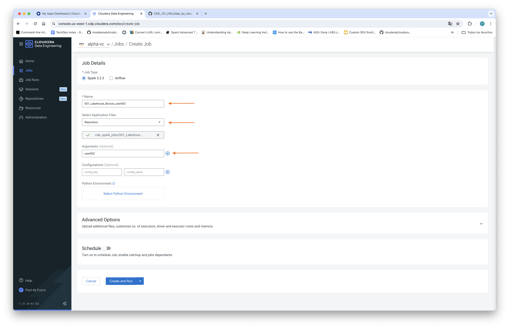
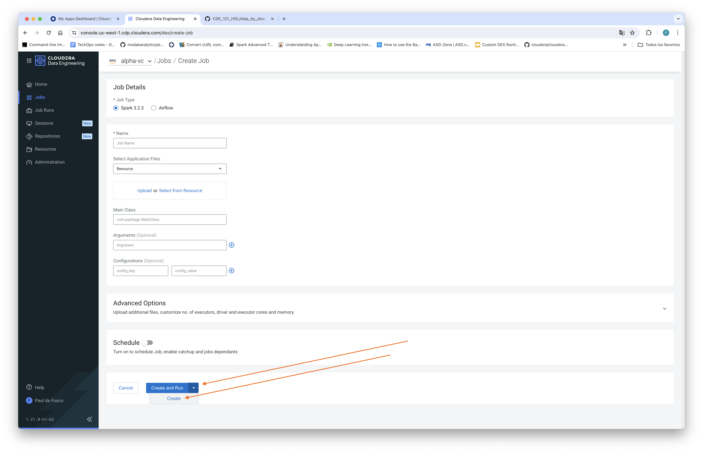
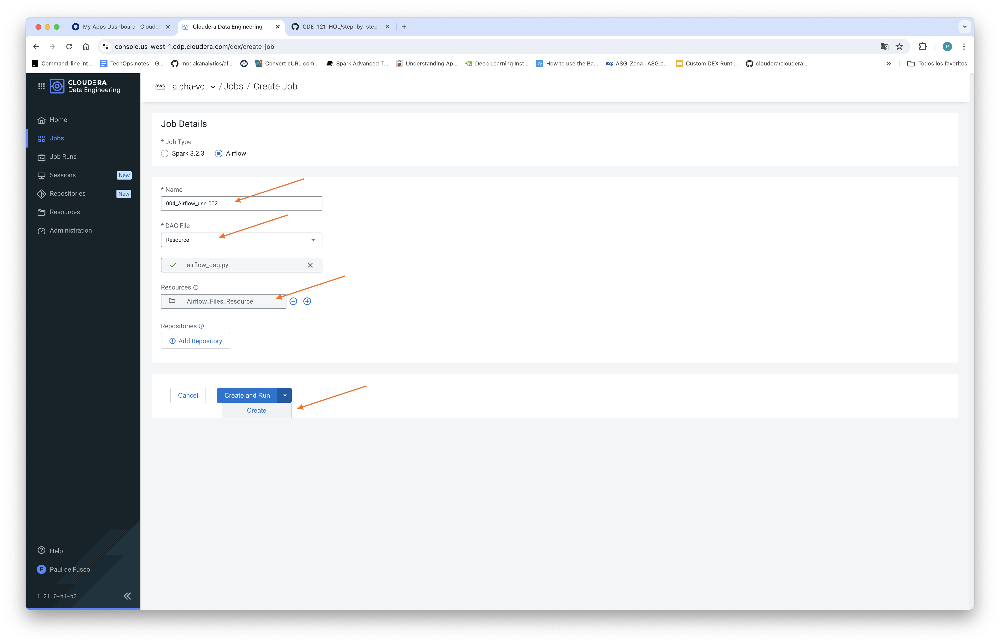

# Distribuição e Orquestração de Jobs

* [Laboratório 3: Criar recursos CDE e jobs Spark](https://github.com/pdefusco/CDE_121_HOL/blob/main/step_by_step_guides/portuguese/part_02_deployment.md#lab-3-criar-recurso-cde-e-jobs-spark)
* [Laboratório 4: Orquestrar um pipeline Spark com Airflow](https://github.com/pdefusco/CDE_121_HOL/blob/main/step_by_step_guides/portuguese/part_02_deployment.md#lab-4-orquestrar-pipeline-spark-com-airflow)
* [Introdução breve ao Apache Airflow](https://github.com/pdefusco/CDE_121_HOL/blob/main/step_by_step_guides/portuguese/part_02_deployment.md#a-brief-introduction-to-airflow)
* [Resumo](https://github.com/pdefusco/CDE_121_HOL/blob/main/step_by_step_guides/portuguese/part_02_deployment.md#summary)
* [Links e recursos úteis](https://github.com/pdefusco/CDE_121_HOL/blob/main/step_by_step_guides/portuguese/part_02_deployment.md#useful-links-and-resources)


### Laboratório 3: Criar recursos CDE e jobs Spark

Até agora, você usou sessões para explorar dados interativamente. O CDE também permite que você execute o código da aplicação Spark em modo batch como Jobs CDE. Existem dois tipos de Jobs CDE: Spark e Airflow. Neste laboratório, você criará um Job Airflow para orquestrar três Jobs Spark.

O Job CDE é uma abstração sobre Spark Submit ou DAG Airflow. Com o Job Spark CDE, você pode criar uma definição modular e reutilizável que é salva no cluster e pode ser modificada através da interface do usuário do CDE (ou através da CLI e API do CDE) a cada execução. O CDE armazena a definição do job para cada execução na página de Execuções dos Jobs, então você pode voltar e referenciá-la muito tempo após a conclusão do seu job.

Além disso, o CDE permite armazenar diretamente artefatos como arquivos Python, Jars e outras dependências, ou criar ambientes Python e contêineres Docker no CDE como "Recursos CDE". Uma vez criados no CDE, os Recursos estão disponíveis para os Jobs CDE como componentes modulares da definição do Job CDE, que podem ser trocados e referenciados por um job específico se necessário.

Essas funcionalidades reduzem significativamente o esforço necessário para gerenciar e monitorar Jobs Spark e Airflow. Fornecendo um painel unificado para todas as suas execuções e uma visão clara de todos os artefatos e dependências associadas, o CDE simplifica as operações de Spark & Airflow.

##### Familiarize-se com o Código

Os scripts da aplicação Spark e os arquivos de configuração usados nestes laboratórios estão disponíveis na [pasta de Jobs Spark CDE do repositório git HOL](https://github.com/pdefusco/CDE_121_HOL/tree/main/cde_spark_jobs). Antes de passar para o próximo passo, familiarize-se com o código dos arquivos "01_Lakehouse_Bronze.py", "002_Lakehouse_Silver.py", "003_Lakehouse_Gold.py", "utils.py", "parameters.conf".

O script DAG Airflow está disponível na [pasta de Jobs Airflow CDE do repositório git HOL](https://github.com/pdefusco/CDE_121_HOL/tree/main/cde_airflow_jobs). Familiarize-se também com o código do script "airflow_dag.py".

* O script "01_Lakehouse_Bronze.py" da aplicação PySpark cria tabelas Iceberg para transações de clientes e cartões de crédito a partir de vários formatos de arquivo. "utils.py" contém um método Python para transformar várias colunas de dataframe simultaneamente, usado pelo script "01_Lakehouse_Bronze.py".

* "parameters.conf" contém uma variável de configuração passada a cada um dos três scripts PySpark. Armazenar variáveis em um Recurso de Arquivo é um método comumente usado por Engenheiros de Dados CDE para parametrizar dinamicamente scripts e passar credenciais ocultas durante a execução.

* "02_Lakehouse_Silver.py" carrega os dados do novo arquivo json das transações, valida com o Great Expectations e adiciona à tabela Transactions.

* "03_Lakehouse_Gold.py" carrega os dados da tabela Transactions filtrando por ID de snapshot Iceberg para refletir apenas o último lote. Em seguida, faz uma junção com a tabela de clientes e usa uma UDF PySpark para filtrar os clientes com base na distância do local da transação. Finalmente, cria uma tabela da camada Gold para fornecer acesso curado aos analistas de negócios e outras partes interessadas autorizadas.

* "airflow_dag.py" orquestra o pipeline de Engenharia de Dados. Primeiro, um bucket AWS S3 é criado; um arquivo simples "my_file.txt" é lido de um Recurso de Arquivo CDE e escrito no bucket S3. Em seguida, os três Jobs Spark CDE discutidos anteriormente são executados para criar uma tabela da camada Gold do Lakehouse.

##### Criar um Repositório CDE

Repositórios Git permitem que as equipes colaborem, gerenciem artefatos do projeto e promovam aplicativos do ambiente de desenvolvimento para o ambiente de produção. O CDE suporta integração com provedores de Git como GitHub, GitLab e Bitbucket para sincronizar as execuções dos jobs com diferentes versões do seu código.

Neste ponto, você criará um Repositório CDE para clonar os scripts PySpark que contêm o Código da Aplicação para seu Job Spark CDE.

Na Página Principal, clique em "Repositório" e depois no ícone azul "Criar Repositório".


Use os seguintes parâmetros para o formulário:

```
Nome do Repositório: CDE_Repo_userxxx
URL: https://github.com/pdefusco/CDE_121_HOL.git
Ramo: main
```


Todos os arquivos do repositório git agora estão armazenados no CDE como um Repositório CDE. Cada participante terá seu próprio repositório CDE.


##### Criar um Recurso de Arquivo CDE

Um recurso no CDE é uma coleção nomeada de arquivos usados por um job ou uma sessão. Os recursos podem incluir código da aplicação, arquivos de configuração, imagens Docker personalizadas e especificações do ambiente virtual Python (requirements.txt). Engenheiros de Dados CDE utilizam Recursos de Arquivo para armazenar arquivos e outras dependências de job no CDE, e depois associá-los às Execuções dos Jobs.

Um Recurso CDE do tipo "Arquivo" que contém os arquivos "parameters.conf" e "utils.py" chamado "Spark_Files_Resource" já foi criado para todos os participantes.

##### Criar um Recurso de Ambiente Python CDE

Um Recurso CDE do tipo "Python" construído com o arquivo requirements.txt e chamado "Python_Resource" já foi criado para todos os participantes. O requirements.txt inclui a lista dos pacotes Python instalados, que serão utilizados pela Execução do Job quando anexados.

Para este laboratório, incluímos o Great Expectations, um framework popular para qualidade e validação de dados.

##### Criar um Job Spark CDE

Agora que você está familiarizado com os Repositórios e Recursos CDE, está pronto para criar seu primeiro Job Spark CDE.

Navegue até a aba de Jobs CDE e clique em "Criar um Job". O longo formulário carregado na página permite que você construa um Spark Submit como Job Spark CDE, passo a passo.

Insira os seguintes valores sem aspas nos campos correspondentes. Certifique-se de atualizar o nome de usuário com o seu usuário atribuído sempre que necessário:

```
* Tipo de Job: Spark
* Nome: 001_Lakehouse_Bronze_userxxx
* Arquivo: Selecione do Repositório -> "cde_spark_jobs/001_Lakehouse_Bronze.py"
* Argumentos: userxxx #e.g. user002
* Opções Avançadas - Recursos: Spark_Files_Resource
* Opções Avançadas - Repositório: CDE_Repo_userxxx e.g. CDE_Repo_user002
* Opções de Cálculo - aumente "Núcleos do Executor" e "Memória do Executor" de 1 para 2.
```

Finalmente, salve o Job CDE clicando no ícone "Criar". ***Por favor, não selecione "Criar e Executar".***




Crie os dois jobs restantes com os seguintes valores:

Job Lakehouse Silver:

```
* Tipo de Job: Spark
* Nome: 002_Lakehouse_Silver_userxxx
* Arquivo: Selecione do Repositório -> "002_Lakehouse_Silver.py"
* Argumentos: userxxx #e.g. user002
* Opções Avançadas - Recursos: Spark_Files_Resource
* Opções Avançadas - Repositório: CDE_Repo_userxxx e.g. CDE

_Repo_user002
```

Job Lakehouse Gold:

```
* Tipo de Job: Spark
* Nome: 003_Lakehouse_Gold_userxxx
* Arquivo: Selecione do Repositório -> "003_Lakehouse_Gold.py"
* Argumentos: userxxx #e.g. user002
* Opções Avançadas - Recursos: Spark_Files_Resource
* Opções Avançadas - Repositório: CDE_Repo_userxxx e.g. CDE_Repo_user002
```

Novamente, ***por favor, crie os jobs mas não os execute.***




### Laboratório 4: Orquestrar um pipeline Spark com Airflow

Neste laboratório, você construirá um pipeline de Jobs Spark para carregar um novo lote de transações, unir com os dados PII dos clientes e criar uma tabela de clientes que podem ser vítimas de fraude com cartão de crédito, incluindo o endereço de e-mail e o nome. Todo o fluxo de trabalho será orquestrado pelo Apache Airflow.

### Introdução breve ao Apache Airflow

O Apache Airflow é uma plataforma para projetar, planejar e executar pipelines de Engenharia de Dados. É amplamente utilizado pela comunidade para criar fluxos de trabalho dinâmicos e robustos para casos de uso de Engenharia de Dados em batch.

A principal característica dos fluxos de trabalho no Airflow é que todos os fluxos de trabalho são definidos em código Python. O código Python que define o fluxo de trabalho é armazenado como uma coleção de Tarefas do Airflow organizadas em um DAG. As atividades são definidas através de operadores integrados e módulos do Airflow. Os operadores são classes Python que podem ser instanciadas para executar ações predefinidas e parametrizadas.

O CDE integra o Apache Airflow a nível do Cluster Virtual CDE. Ele é distribuído automaticamente para o usuário CDE quando o Cluster Virtual CDE é criado e não requer manutenção pelo Administrador CDE. Além dos operadores básicos, o CDE suporta o CDEJobRunOperator e o CDWOperator para acionar Jobs Spark e consultas de Datawarehousing.

##### Criar um Recurso de Arquivo Airflow

Assim como os Jobs Spark CDE, os jobs do Airflow podem usar os Recursos de Arquivo CDE para carregar arquivos, incluindo conjuntos de dados ou parâmetros de execução. Um Recurso de Arquivo CDE chamado "Airflow_Files_Resource" que contém o arquivo "my_file.txt" já foi criado para todos os participantes.

##### Criar um Job Airflow

Abra o script "004_airflow_dag.py" localizado na pasta "cde_airflow_jobs". Familiarize-se com o código e observe:

* As classes Python necessárias para os Operadores DAG são importadas na parte superior. Note que o CDEJobRunOperator está incluído para executar Jobs Spark no CDE.
* O dicionário "default_args" inclui opções para agendamento, definição de dependências e execução geral.
* Três instâncias do objeto CDEJobRunOperator são declaradas. Elas refletem os três Jobs Spark CDE que você criou anteriormente.
* Finalmente, na parte inferior do DAG, as Dependências das Tarefas são declaradas. Com essa declaração, você pode especificar a sequência de execução das tarefas do DAG.

Baixe o arquivo do [URL](https://github.com/pdefusco/CDE_121_HOL/tree/main/cde_airflow_jobs) para sua máquina local. Abra-o no seu editor preferido e modifique a variável de usuário na linha 52.

Em seguida, navegue até a interface de Jobs CDE e crie um novo Job CDE. Selecione Airflow como Tipo de Job. Selecione o script "004_airflow_dag.py" e escolha criar um novo Recurso de Arquivo nomeado de acordo com suas preferências no processo. Finalmente, adicione a dependência do Recurso de Arquivo onde você carregou "my_file.txt".




Monitore a execução do pipeline na interface de Execuções dos Jobs. Observe que um Job Airflow será acionado e, em seguida, os três Jobs Spark CDE serão executados um por um.

Enquanto o job está em andamento, abra a interface do Airflow e monitore a execução.


### Resumo

O Cloudera Data Engineering (CDE) é um serviço serverless para a Cloudera Data Platform que permite que você envie jobs batch para clusters virtuais com auto-scaling. O CDE permite que você dedique mais tempo às suas aplicações e menos tempo à infraestrutura.

Nestes laboratórios, você aprimorou seu código para torná-lo reutilizável, modularizando sua lógica em funções e armazenando essas funções como utilitários em um Recurso de Arquivo CDE. Você aproveitou seu Recurso de Arquivo armazenando variáveis dinâmicas em um arquivo de configuração de parâmetros e aplicando uma variável na execução através do campo Argumentos. Como parte de pipelines Spark CI/CD mais avançados, o arquivo de parâmetros e o campo Argumentos podem ser substituídos e trocados durante a execução.

Você então usou o Apache Airflow não apenas para orquestrar esses três jobs, mas também para executá-los como parte de um pipeline de Engenharia de Dados mais complexo que envolvia recursos na AWS. Graças ao vasto ecossistema de provedores open source do Airflow, você também pode operar em sistemas externos e de terceiros.

Finalmente, você executou o job e observou as saídas na página de Execuções dos Jobs CDE. O CDE armazenou as Execuções dos Jobs, os logs e os Recursos CDE associados para cada execução. Isso forneceu a você capacidades de monitoramento e resolução de problemas em tempo real, bem como armazenamento pós-execução de logs, dependências de execução e informações sobre o cluster. Você explorará o Monitoramento e a Observabilidade em detalhes nos próximos laboratórios.


### Links e recursos úteis

* [Trabalhando com Recursos de Arquivos CDE](https://community.cloudera.com/t5/Community-Articles/Working-with-CDE-Files-Resources/ta-p/379891)
* [Monitoramento eficaz de Jobs, Execuções e Recursos com a CLI CDE](https://community.cloudera.com/t5/Community-Articles/Efficiently-Monitoring-Jobs-Runs-and-Resources-with-the-CDE/ta-p/379893)
* [Trabalhando com Parâmetros de Jobs Spark CDE no Cloudera Data Engineering](https://community.cloudera.com/t5/Community-Articles/Working-with-CDE-Spark-Job-Parameters-in-Cloudera-Data/ta-p/380792)
* [Como analisar arquivos XML no CDE com o Pacote XML Spark](https://community.cloudera.com/t5/Community-Articles/How-to-parse-XMLs-in-Cloudera-Data-Engineering-with-the/ta-p/379451)
* [Spark Geoespacial com Apache Sedona no CDE](https://community.cloudera.com/t5/Community-Articles/Spark-Geospatial-with-Apache-Sedona-in-Cloudera-Data/ta-p/378086)
* [Automatizar Pipelines de Dados usando Apache Airflow no CDE](https://docs.cloudera.com/data-engineering/cloud/orchestrate-workflows/topics/cde-airflow-dag-pipeline.html)
* [Utilizar CDE Airflow](https://github.com/pdefusco/Using_CDE_Airflow)
* [Documentação sobre Parâmetros dos DAGs Airflow](https://airflow.apache.org/docs/apache-airflow/stable/tutorial.html#default-arguments)
* [Explorar a Arquitetura Iceberg](https://github.com/pdefusco/Exploring_Iceberg_Architecture)
* [Qualidade dos Dados Empresariais em Grande Escala no CDE com Great Expectations e Runtimes Personalizados CDE](https://community.cloudera.com/t5/Community-Articles/Enterprise-Data-Quality-at-Scale-with-Spark-and-Great/ta-p/378161)
